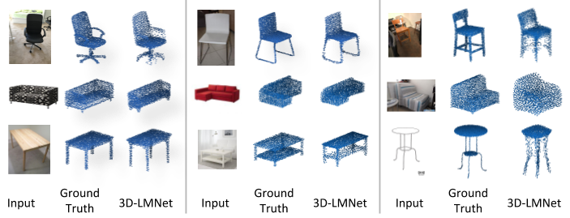

# 3D-LMNet
This repository contains the source codes for the paper [3D-LMNet: Latent Embedding Matching For Accurate and Diverse 3D Point Cloud Reconstruction From a Single Image](https://arxiv.org/abs/1807.07796).</br>
Accepted at *British Machine Vision Conference (BMVC 2018)*

## Citing this work
If you find this work useful in your research, please consider citing:
```
@inproceedings{mandikal20183dlmnet,
 author = {Mandikal, Priyanka and Navaneet, K L and Agarwal, Mayank and Babu, R Venkatesh},
 booktitle = {Proceedings of the British Machine Vision Conference ({BMVC})},
 title = {{3D-LMNet}: Latent Embedding Matching for Accurate and Diverse 3D Point Cloud Reconstruction from a Single Image},
 year = {2018}
}
```

## Overview
3D-LMNet is a latent embedding matching approach for 3D point cloud reconstruction from a single image. To better incorporate the data prior and generate meaningful reconstructions, we first train a 3D point cloud auto-encoder and then learn a mapping from the 2D image to the corresponding learnt embedding. For a given image, there may exist multiple plausible 3D reconstructions depending on the object view. To tackle the issue of uncertainty in the reconstruction, we predict multiple reconstructions that are consistent with the input view, by learning a probablistic latent space using a view-specific ‘diversity loss’. We show that learning a good latent space of 3D objects is essential for the task of single-view 3D reconstruction.


## Dataset

### ShapeNet
We train and validate our model on the ShapeNet dataset. We use the rendered images from the dataset provided by <a href="https://github.com/chrischoy/3D-R2N2" target="_blank" >3d-r2n2</a>, which consists of 13 object categories. For generating the ground truth point clouds, we sample points on the corresponding object meshes from ShapeNet. We use the dataset split provided by r2n2 in all the experiments. Data download links are provided below:<br>
Rendered Images (~12.3 GB): http://cvgl.stanford.edu/data2/ShapeNetRendering.tgz <br>
ShapeNet pointclouds (~2.8 GB): https://drive.google.com/open?id=1cfoe521iTgcB_7-g_98GYAqO553W8Y0g <br>
ShapeNet train/val split: https://drive.google.com/open?id=10FR-2Lbn55POB1y47MJ12euvobi6mgtc

Download each of the folders, extract them and move them into *data/shapenet/*.<br>
The folder structure should now look like this:<br>
--data/shapenet/<br>
&nbsp;&nbsp;--ShapeNetRendering/<br>
&nbsp;&nbsp;--ShapeNet_pointclouds/<br>
&nbsp;&nbsp;--splits/<br>

### Pix3D
We evaluate the generalization capability of our model by testing it on the real-world <a href="https://github.com/xingyuansun/pix3d">pix3d dataset</a>. For the ground truth point clouds, we sample 1024 points on the provided meshes. Data download links are provided below:<br>
Pix3D dataset (~20 GB): Follow the instructions in https://github.com/xingyuansun/pix3d <br>
Pix3D pointclouds (~13 MB): https://drive.google.com/open?id=1RZakyBu9lPbG85SyconBn4sR8r2faInV

Download each of the folders, extract them and move them into *data/pix3d/*.<br>
The folder structure should now look like this:<br>
--data/pix3d/<br>
&nbsp;&nbsp;--img_cleaned_input/<br>
&nbsp;&nbsp;--img/<br>
&nbsp;&nbsp;--mask/<br>
&nbsp;&nbsp;--model/<br>
&nbsp;&nbsp;--pix3d_pointclouds/<br>
&nbsp;&nbsp;--pix3d.json<br>

## Usage
Install [TensorFlow](https://www.tensorflow.org/install/). We recommend version 1.3 so that the additional TensorFlow ops can be compiled. The code provided has been tested with Python 2.7, TensorFlow 1.3, and CUDA 8.0. The following steps need to be performed to run the codes given in this repository:

1. Clone the repository:
```shell
git clone https://github.com/val-iisc/3d-lmnet.git
cd 3d-lmnet
```
2. Tensorflow ops for losses (Chamfer and EMD) as well as for point cloud visualization need to be compiled. Run the makefile as given below. (Note that the the nvcc, cudalib, and tensorflow paths inside the makefile need to be updated to point to the locations on your machine):
```shell
make
```

## Training
- To train the point-cloud auto-encoder, run:
```shell
bash scripts/train_ae.sh
```
Note that the auto-encoder needs to be trained before training either of the latent matching setups.

- To train the latent matching (lm) setup, run:
```shell
bash scripts/train_lm.sh
```

- To train the probabilistic latent matching (plm) setup, run:
```shell
bash scripts/train_plm.sh
```

## Trained Models
Create a folder called 'trained_models' inside the project folder:
```
mkdir trained_models
```
- Download the trained model for latent matching (lm) here:<br>
[https://drive.google.com/open?id=1nl30z1CJL5WZn8svFllHkVLvS4GWiAxf](https://drive.google.com/open?id=1nl30z1CJL5WZn8svFllHkVLvS4GWiAxf) <br>
Extract it and move it into *trained_models/*

- Download the trained model for probabilistic latent matching (plm) here:<br>
[https://drive.google.com/open?id=1iYUOPTrhwAIwubihrBhLGG-KVD4Qr7is](https://drive.google.com/open?id=1iYUOPTrhwAIwubihrBhLGG-KVD4Qr7is) <br>
Extract it and move it into *trained_models/*

## Evaluation
Follow the steps detailed above to download the dataset and pre-trained models.

### ShapeNet
- For computing the Chamfer and EMD metrics reported in the paper (all 13 categories), run:
```shell
bash scripts/metrics_shapenet_lm.sh
```
The computed metrics will be saved inside *trained_models/lm/metrics_shapenet/*

- For the plm setup (chair category), run:
```shell
bash scripts/metrics_shapenet_plm.sh
```
The computed metrics will be saved inside *trained_models/plm/metrics_shapenet/*

### Pix3D
- For computing the Chamfer and EMD metrics reported in the paper (3 categories) for the real-world Pix3D dataset, run:
```shell
bash scripts/metrics_pix3d.sh
```
The computed metrics will be saved inside *trained_models/lm/metrics_pix3d/*

## Demo
Follow the steps detailed above to download the dataset and pre-trained models.

###  ShapeNet
- Run the following to visualize the results for latent matching (lm):
```shell
bash scripts/demo_shapenet_lm.sh
```
You can navigate to the next visualization by pressing 'q'. Close visualization using back arrow. You can visualize results for different categories by changing the value of the category flag.

- Run the following to visualize the results for probabilistic latent matching (plm):
```shell
bash scripts/demo_shapenet_plm.sh
```

###  Pix3D
- Run the following to visualize the results on the real-world Pix3D dataset:
```shell
bash scripts/demo_pix3d.sh
```
You can navigate to the next visualization by pressing 'q'. Close visualization using back arrow.
## Sample Results
### ShapeNet
Below are a few sample reconstructions from our trained model tested on ShapeNet.


### Pix3D
Below are a few sample reconstructions from our trained model tested on real-world Pix3D dataset. Note that we mask out the background using the provided masks before passing the images through the network.


