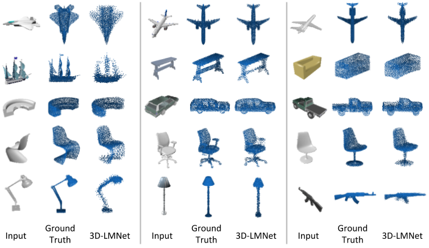

# 3D-LMNet
This repository contains the source codes for the paper [3D-LMNet: Latent Embedding Matching For Accurate and Diverse 3D Point Cloud Reconstruction From a Single Image](https://arxiv.org/abs/1807.07796).</br>
Accepted at *British Machine Vision Conference (BMVC 2018)*

## Citing this work
If you find this work useful in your research, please consider citing:
```
@inproceedings{mandikal20183dlmnet,
 author = {Mandikal, Priyanka and K L, Navaneet and Agarwal, Mayank and Babu, R Venkatesh},
 booktitle = {Proceedings of the British Machine Vision Conference ({BMVC})},
 title = {{3D-LMNet}: Latent Embedding Matching for Accurate and Diverse 3D Point Cloud Reconstruction from a Single Image},
 year = {2018}
}
```

## Overview
3D-LMNet is a latent embedding matching approach for 3D point cloud reconstruction from a single image. To better incorporate the data prior and generate meaningful reconstructions, we first train a 3D point cloud auto-encoder and then learn a mapping from the 2D image to the corresponding learnt embedding. For a given image, there may exist multiple plausible 3D reconstructions depending on the object view. To tackle the issue of uncertainty in the reconstruction, we predict multiple reconstructions that are consistent with the input view, by learning a probablistic latent space using a view-specific ‘diversity loss’. We show that learning a good latent space of 3D objects is essential for the task of single-view 3D reconstruction.


## Dataset
We use the rendered images from the dataset provided by <a href="https://github.com/chrischoy/3D-R2N2" target="_blank" >3d-r2n2</a>, which consists of 13 object categories. For generating the ground truth point clouds, we sample points on the corresponding object meshed from ShapeNet. We use the dataset split provided by r2n2 in all the experiments. Due to memory contraints, we do not provide the entire training dataset. The same can be downloaded from the following links:<br>
Rendered Images: http://cvgl.stanford.edu/data2/ShapeNetRendering.tgz<br>
ShapeNet meshes: https://www.shapenet.org/

However, we do provide the validation data for evaluation purposes. Kindly refer to the 'Evaluation' Section.

## Usage
Install [TensorFlow](https://www.tensorflow.org/install/). The code has been tested with Python 2.7, TensorFlow 1.3, and CUDA 8.0. 

1. Clone the repository:
```shell
git clone https://github.com/val-iisc/3d-lmnet.git
cd 3d-lmnet
```
2. 

For computing the Chamfer and EMD metrics, the following codes will have to be compiled.

## Training
To train the point-cloud auto-encoder, run
```shell
bash scripts/run_ae.py --data_dir <dataset_path>
```

To train the latent matching (lm) setup, run
```shell
bash scripts/run_lm.py --data_dir <dataset_path>
```

To train the probabilistic latent matching (plm) setup, run
```shell
bash scripts/run_plm.py --data_dir <dataset_path>
```

## Trained Models
- Download the trained model for latent matching (lm) here:<br>
[https://drive.google.com/open?id=1nl30z1CJL5WZn8svFllHkVLvS4GWiAxf](https://drive.google.com/open?id=1nl30z1CJL5WZn8svFllHkVLvS4GWiAxf) <br>
Extract it and move it into trained_models/

- Download the trained model for probabilistic latent matching (plm) here:<br>
[https://drive.google.com/open?id=1iYUOPTrhwAIwubihrBhLGG-KVD4Qr7is](https://drive.google.com/open?id=1iYUOPTrhwAIwubihrBhLGG-KVD4Qr7is) <br>
Extract it and move it into trained_models/

## Evaluation
We provide the validation dataset (inputy images + ground truth point clouds) in the below link:<br>
[https://drive.google.com/open?id=10r86aGDkBw0KspV7xB6X51-TGoTZmZmk](https://drive.google.com/open?id=10r86aGDkBw0KspV7xB6X51-TGoTZmZmk)<br>
Extract it and move it into data/

- For computing the Chamfer and EMD metrics reported in the paper (all 13 categories), run:
```shell
bash scripts/metrics_lm.sh
```
The computed metrics will be saved inside trained_models/lm/metrics/

- For the plm setup (chair category), run:
```shell
bash scripts/metrics_plm.sh
```
The computed metrics will be saved inside trained_models/plm/metrics/

## Demo
Follow the steps given above to download and extract the validation data.

- Run the following to visualize the results:
```shell
bash scripts/metrics_lm.sh --visualize
```

- For plm:
```shell
bash scripts/metrics_plm.sh --visualize
```

## Sample Results
Below are a few sample reconstructions from our trained model.


